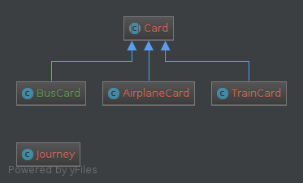

# Transportation system

In order to run this code you need to be running at least PHP version 5.6

There are 2 tests available, inside `test.php` and `test2.php`
* `test.php` contains the transportation cards from the PDF specification
* `test2.php` contains different values for the transportation cards

In order to execute the code, run it in the shell/cli (command line), inside the project folder, like so:
`php test.php` or `php test2.php`

You should get an output like this one:
```
Going from Madrid to New York JFK, using 4 transportation cards
----------------
1. Take the train 78A from Madrid to Barcelona. Sit in seat 45B.
2. Take the bus from Barcelona to Gerona Airport. No seat assignment.
3. From Gerona Airport, take flight SK455 to Stockholm. Gate 3A, seat 45B. Baggage drop at ticket counter 344.
4. From Stockholm, take flight SK22 to New York JFK. Gate 7B, seat 22. Baggage will we automatically transferred from your last leg.
----------------
You have arrived at your final destination.
```

You are free to modify any of the 2 files in order to change the input.

## Classes information

The 2 main classes are:
* `Transportation\Card` - Abstract base class for any type of transportation card. Holds an abstract method called "formatRoute" that formats the displayed information according to the type of transportation method.
* `Transportation\BusCard` - Transportation card for Buses
* `Transportation\TrainCard` - Transportation card for Trains
* `Transportation\AirplaneCard` - Transportation card for Airplanes
* `Transportation\Journey` - gets as input the transportation cards and calculates the journey, returning the correct ordered list of cards, or an empty array if the route is not valid. (see method `calculate`).

